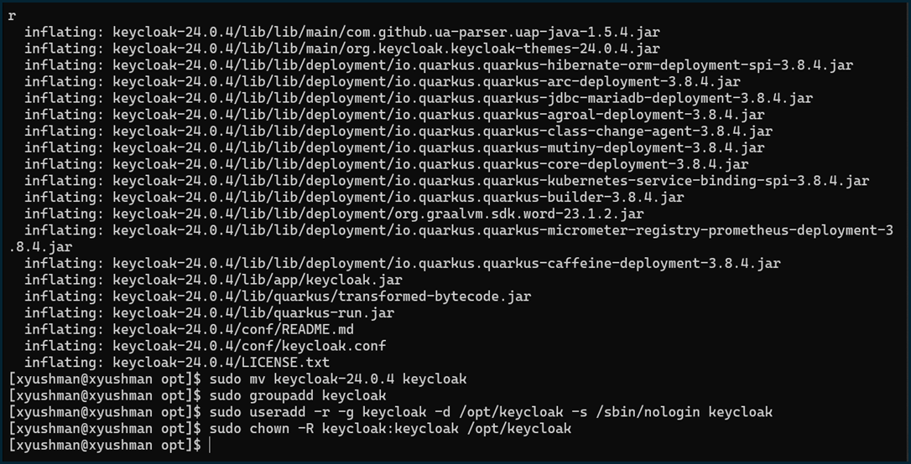
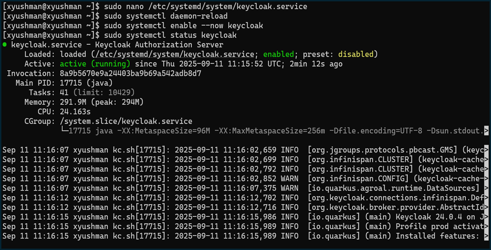
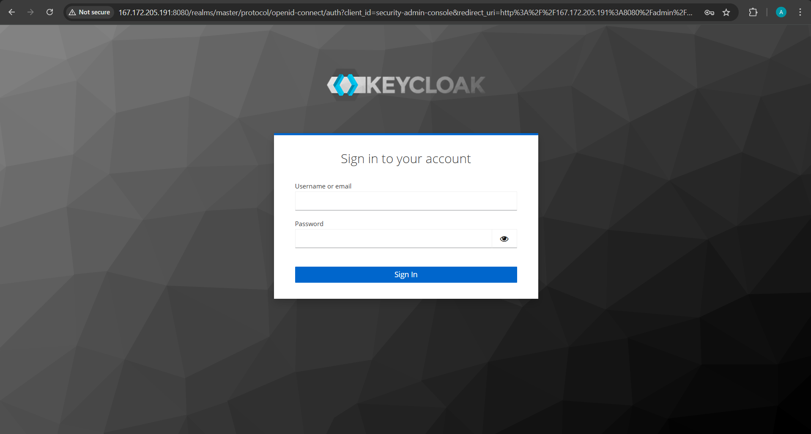
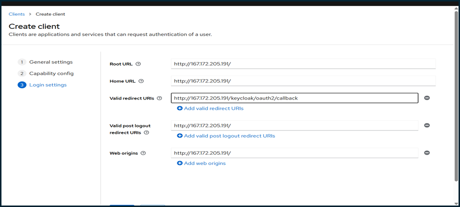

# 02. Keycloak Configuration Guide

## Keycloak Installation

### Step 1: Download and Install Keycloak

Navigated to the `/opt` directory for installation:
```bash
cd /opt
```

Downloaded the latest stable Keycloak version (24.0.4):
```bash
# Download Keycloak
sudo wget https://github.com/keycloak/keycloak/releases/download/24.0.4/keycloak-24.0.4.zip

# Extract the package
sudo unzip keycloak-24.0.4.zip

# Rename directory for simplicity
sudo mv keycloak-24.0.4 keycloak
```

### Step 2: Create Dedicated System User

Created a dedicated user for Keycloak for security purposes:
```bash
# Create keycloak group
sudo groupadd keycloak

# Create keycloak user with restricted permissions
sudo useradd -r -g keycloak -d /opt/keycloak -s /sbin/nologin keycloak

# Set proper ownership
sudo chown -R keycloak:keycloak /opt/keycloak

```



### Step 3: Initial Keycloak Setup

Started Keycloak in development mode to create the initial admin user:
```bash
# Set admin credentials
export KEYCLOAK_ADMIN=admin
export KEYCLOAK_ADMIN_PASSWORD=q4tdqs7a

# Start Keycloak in development mode
/opt/keycloak/bin/kc.sh start-dev --http-port=8080
```

Accessed the Keycloak admin console at `http://167.172.205.191:8080` and completed the initial setup by creating the admin user.

### Step 4: Create Production Systemd Service

Created a systemd service file for production deployment:
```bash
sudo nano /etc/systemd/system/keycloak.service
```

Added the following configuration:
```ini
[Unit]
Description=Keycloak Authorization Server
After=network.target

[Service]
Type=idle
User=keycloak
Group=keycloak
ExecStart=/opt/keycloak/bin/kc.sh start --optimized --http-port=8080
LimitNOFILE=102400
LimitNPROC=102400
TimeoutStartSec=600
Restart=on-failure
RestartSec=30

[Install]
WantedBy=multi-user.target
```

Enabled and started the Keycloak service:
```bash
# Reload systemd configuration
sudo systemctl daemon-reload

# Enable and start Keycloak
sudo systemctl enable --now keycloak

# Verify service status
sudo systemctl status keycloak

```



### Step 5: Verify Keycloak Installation

Confirmed Keycloak was running properly:
```bash
# Check service status
sudo systemctl status keycloak

# Check listening ports
sudo netstat -tlnp | grep 8080

# Verify accessibility
curl http://localhost:8080
```

## Keycloak Realm and Client Configuration

### Step 6: Access Keycloak Admin Console

Accessed the Keycloak Admin Console:
- URL: http://167.172.205.191:8080
- Username: admin
- Password: q4tdqs7a



### Step 7: Configure Clients for Applications

Created three clients for the different applications:

#### 1. Drupal Client
- **Client ID**: drupal
- **Client Protocol**: openid-connect
- **Access Type**: confidential
- **Valid Redirect URIs**: http://167.172.205.191/openid-connect/keycloak
- **Web Origins**: http://167.172.205.191
- **Client Secret**: Retrieved from Credentials tab

#### 2. Django Client
- **Client ID**: django
- **Client Protocol**: openid-connect
- **Access Type**: confidential
- **Valid Redirect URIs**: http://167.172.205.191/django/oidc/callback/
- **Client Secret**: Retrieved from Credentials tab

#### 3. PHP Application Client
- **Client ID**: php-app
- **Client Protocol**: openid-connect
- **Access Type**: confidential
- **Valid Redirect URIs**: http://167.172.205.191/php/login.php
- **Client Secret**: Retrieved from Credentials tab


### Step 8: Realm Configuration

Used the default `master` realm for testing purposes. Configured the following:

1. **User Management**: Created test users for SSO testing
2. **Client Scopes**: Configured optional client scopes for different applications
3. **Authentication Flows**: Used default flows suitable for web applications

## Security Considerations

### SSL Configuration (Note for Production)
For production environments, additional SSL configuration is recommended:
- Set up reverse proxy with SSL termination
- Configure Keycloak to use HTTPS
- Update client redirect URIs to use HTTPS

### Database Configuration (Note for Production)
For production use, consider migrating from the default H2 database to MariaDB:
```bash
# Example production database configuration
/opt/keycloak/bin/kc.sh build --db=mariadb
```

## Verification

Tested Keycloak functionality:
1. ✅ Admin console accessible
2. ✅ Clients created successfully
3. ✅ Service running on port 8080
4. ✅ User authentication working
5. ✅ Client secrets properly configured

## Keycloak Information
- **Version**: 24.0.4
- **Admin URL**: http://167.172.205.191:8080
- **Realm**: master
- **Clients**: drupal, django, php-app

Keycloak was successfully installed, configured, and integrated with the system services. The SSO foundation was now ready for application integration.

---

**Next Step**: [Drupal Integration with Keycloak SSO](03-drupal-integration.md)