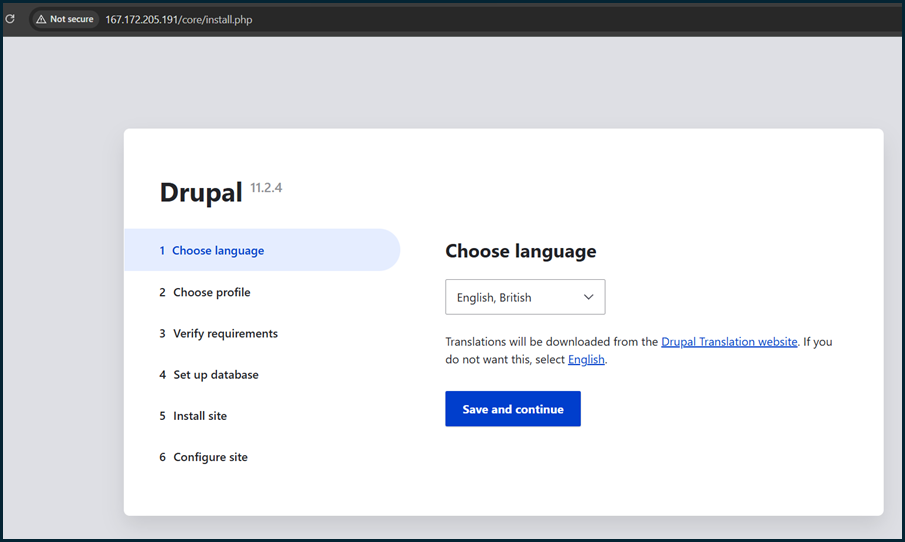

# 03. Drupal Integration with Keycloak SSO

## Drupal 11 Installation and Configuration

### Step 1: Database Setup for Drupal

Created a dedicated database and user for Drupal:

```bash
# Log in to MariaDB
sudo mysql -u root -p

# Create database and user
CREATE DATABASE drupaldb CHARACTER SET utf8mb4 COLLATE utf8mb4_unicode_ci;
CREATE USER 'drupaluser'@'localhost' IDENTIFIED BY 'q4tdqs7a';
GRANT ALL PRIVILEGES ON drupaldb.* TO 'drupaluser'@'localhost';
FLUSH PRIVILEGES;
EXIT;
```

### Step 2: Install Drupal Using Composer

```bash
# Navigate to web directory
cd /var/www/

# Install Composer
sudo dnf install composer -y

# Create Drupal project
sudo composer create-project drupal/recommended-project drupal

# Set proper permissions
sudo chown -R apache:apache /var/www/drupal
sudo chmod -R 755 /var/www/drupal/web
```

### Step 3: Configure Apache Virtual Host

Created Apache configuration for Drupal:

```bash
sudo nano /etc/httpd/conf.d/drupal.conf
```

Added the following configuration:
```apache
<VirtualHost *:80>
  ServerName 167.172.205.191
  DocumentRoot /var/www/drupal/web

  <Directory /var/www/drupal/web>
    AllowOverride All
    Require all granted
  </Directory>

  ErrorLog /var/log/httpd/drupal_error.log
  CustomLog /var/log/httpd/drupal_access.log combined
</VirtualHost>
```

Restarted Apache to apply changes:
```bash
sudo systemctl restart httpd
```

### Step 4: Complete Drupal Web Installation

Accessed Drupal installation wizard at `http://167.172.205.191` and completed the installation:

1. **Choose language**: English
2. **Choose profile**: Standard
3. **Verify requirements**: All requirements met


4. **Set up database**:
   - Database type: MySQL/MariaDB
   - Database name: drupaldb
   - Database username: drupaluser
   - Database password: q4tdqs7a
5. **Install site**: Completed installation
6. **Configure site**:
   - Site name: Drupal with Keycloak SSO
   - Site email: admin@example.com
   - Admin username: admin
   - Admin password: q4tdqs7a
   - Default country: United States
   - Default time zone: UTC


### Step 5: File System Configuration

Set up proper file permissions for Drupal:

```bash
# Create files directory
sudo mkdir -p /var/www/drupal/web/sites/default/files
sudo chown -R apache:apache /var/www/drupal/web/sites/default/files
sudo chmod -R 775 /var/www/drupal/web/sites/default/files

# Setup settings.php
cd /var/www/drupal/web/sites/default
sudo cp default.settings.php settings.php
sudo chown apache:apache settings.php
sudo chmod 664 settings.php

# SELinux configuration (if enabled)
sudo chcon -R -t httpd_sys_rw_content_t /var/www/drupal/web/sites/default/files
sudo chcon -t httpd_sys_rw_content_t /var/www/drupal/web/sites/default/settings.php

# Restart Apache
sudo systemctl restart httpd
```

## Keycloak SSO Integration

### Step 6: Install Keycloak OIDC Module

```bash
# Navigate to Drupal directory
cd /var/www/drupal

# Install Keycloak module with proper stability settings
composer config minimum-stability dev
composer config prefer-stable true
composer require drupal/keycloak:2.2.x-dev --dev --with-all-dependencies
```

### Step 7: Enable Keycloak Module

1. Logged into Drupal admin panel (`http://167.172.205.191/user/login`)
2. Navigated to **Extend** (`/admin/modules`)
3. Enabled the **Keycloak** module
4. Saved configuration

### Step 8: Configure Keycloak Module

1. Navigated to **Configuration > People > OpenID Connect > Clients** (`/admin/config/people/oidc_connect/clients`)

2. Clicked **Edit** on the Keycloak client
3. Configured the following settings:
   - **Name**: Keycloak
   - **Client ID**: drupal
   - **Client Secret**: [Retrieved from Keycloak admin console]
   - **Allowed domains**: 167.172.205.191
   - **Keycloak base URL**: http://167.172.205.191:8080
   - **Keycloak realm**: master
   - **Redirect URL**: http://167.172.205.191/openid-connect/keycloak
   - **Update email address in user profile**: Enabled
   - **Replace Drupal login with Keycloak single sign-on (SSO)**: Enabled
   - **Enable Drupal-initiated single sign-out**: Enabled
   - **Enable Keycloak-initiated single sign-out**: Enabled


4. Saved the configuration

### Step 9: Keycloak Client Configuration

In the Keycloak Admin Console (`http://167.172.205.191:8080`):

1. Navigated to **Clients** > **drupal**
2. Verified configuration:
   - **Client Protocol**: openid-connect
   - **Access Type**: confidential
   - **Valid Redirect URIs**: http://167.172.205.191/openid-connect/keycloak
   - **Web Origins**: http://167.172.205.191
3. Copied the **Client Secret** from the **Credentials** tab
4. Updated the Drupal Keycloak module configuration with the client secret


## Testing and Verification

### Step 10: Test SSO Integration

1. Opened a private/incognito browser window
2. Navigated to `http://167.172.205.191/user/login`
3. Verified the login page showed a "Log in with Keycloak" option
4. Clicked the Keycloak login option
5. Was redirected to Keycloak login page
6. Entered Keycloak credentials (admin/q4tdqs7a)
7. Was successfully redirected back to Drupal and automatically logged in
8. Verified user profile information was populated from Keycloak

### Step 11: Troubleshooting

Encountered and resolved the following issues:

1. **Redirect URI mismatch**: Updated Keycloak client configuration to match Drupal's redirect URL
2. **Client secret mismatch**: Ensured the secret in Drupal matched the one in Keycloak
3. **SSL issues**: Used HTTP for development (would use HTTPS in production)

## Final Configuration

### Drupal Site Information
- **URL**: http://167.172.205.191
- **Admin username**: admin
- **Admin password**: q4tdqs7a
- **Database**: drupaldb
- **Keycloak integration**: Fully functional

### Keycloak Client Configuration
- **Client ID**: drupal
- **Client Protocol**: openid-connect
- **Access Type**: confidential
- **Redirect URI**: http://167.172.205.191/openid-connect/keycloak

The Drupal integration with Keycloak SSO was successfully completed, allowing users to authenticate through Keycloak instead of Drupal's native authentication system.

---

**Next Step**: [Django Integration with Keycloak SSO](04-django-integration.md)