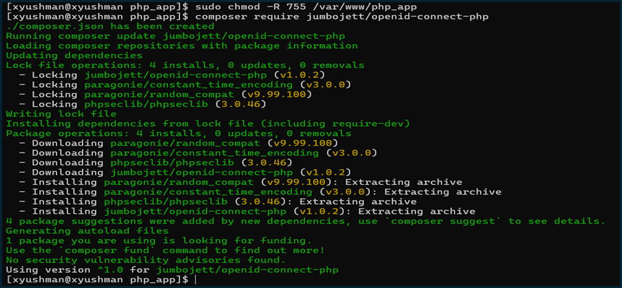
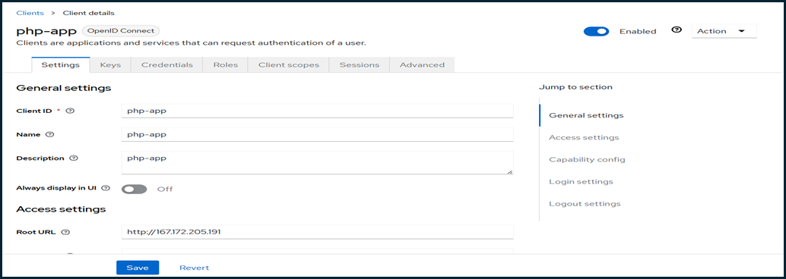

# 05. PHP Application Integration with Keycloak SSO

## PHP Application Setup and Configuration

### Step 1: Create PHP Application Directory

```bash
# Create directory for PHP application
sudo mkdir /var/www/php_app

# Set proper ownership and permissions
sudo chown -R apache:apache /var/www/php_app
sudo chmod -R 755 /var/www/php_app
```

### Step 2: Install OIDC PHP Library

```bash
# Navigate to PHP application directory
cd /var/www/php_app

# Install OpenID Connect PHP library using Composer
composer require jumbojett/openid-connect-php
```



### Step 3: Create PHP Application Files

Created the main application files for the PHP OIDC integration:

**login.php** - Handles the OIDC authentication flow:
```php
<?php
require 'vendor/autoload.php';
use Jumbojett\OpenIDConnectClient;

session_start();

$oidc = new OpenIDConnectClient(
    'http://167.172.205.191:8080/realms/master', // Keycloak provider URL
    'php-app',                                  // Client ID
    'your_client_secret_from_keycloak'          // Client Secret
);

// Explicitly set the redirect URI to HTTP
$oidc->setRedirectURL("http://167.172.205.191/php/login.php");

// Request additional scopes for user info
$oidc->addScope(['openid', 'profile', 'email']);

// This triggers the authentication flow
$oidc->authenticate();

// Store user info in the session
$_SESSION['user_info'] = $oidc->requestUserInfo();

// Redirect to a protected page
header("Location: /php/profile.php");
exit();
?>
```



**profile.php** - Displays user information after successful authentication:
```php
<?php
session_start();

if (empty($_SESSION['user_info'])) {
    header("Location: /php/login.php");
    exit();
}

$userInfo = $_SESSION['user_info'];

// Try different ways to access the user info
$name = '';
$email = '';

if (is_object($userInfo)) {
    $name = $userInfo->name ?? $userInfo->preferred_username ?? '';
    $email = $userInfo->email ?? '';
} elseif (is_array($userInfo)) {
    $name = $userInfo['name'] ?? $userInfo['preferred_username'] ?? '';
    $email = $userInfo['email'] ?? '';
}

echo "<h1>Welcome, " . htmlspecialchars($name) . "</h1>";
echo "<p>Email: " . htmlspecialchars($email) . "</p>";

// Add a logout link
echo '<p><a href="/php/login.php?logout=true">Logout</a></p>';
?>
```

**index.php** - Simple redirect to login page:
```php
<?php
header("Location: /php/login.php");
exit();
?>
```

### Step 4: Configure Apache for PHP Application

Added PHP application configuration to the combined Apache configuration:

```bash
sudo nano /etc/httpd/conf.d/combined.conf
```

Added the PHP application section:
```apache
# === PHP app at /php ===
Alias /php/ /var/www/php_app/
<Directory /var/www/php_app>
    Options Indexes FollowSymLinks
    AllowOverride All
    Require all granted
    DirectoryIndex index.php index.html
    <FilesMatch \.php$>
        SetHandler "proxy:unix:/run/php-fpm/www.sock|fcgi://localhost/"
    </FilesMatch>
</Directory>
```

Restarted Apache to apply changes:
```bash
sudo systemctl restart httpd
```

### Step 5: PHP Session Configuration

Ensured PHP sessions were properly configured:

```bash
# Create and set permissions for PHP session directory
sudo mkdir -p /var/lib/php/session
sudo chown -R apache:apache /var/lib/php/session
sudo chmod -R 733 /var/lib/php/session
```

## Keycloak Client Configuration

### Step 6: Configure Keycloak Client for PHP Application

In the Keycloak Admin Console (`http://167.172.205.191:8080`):

1. Navigated to **Clients** > **Create client**
2. Configured the PHP application client:
   - **Client ID**: php-app
   - **Client Protocol**: openid-connect
   - **Access Type**: confidential
   - **Valid Redirect URIs**: http://167.172.205.191/php/login.php
3. Saved the configuration and copied the **Client Secret** from the **Credentials** tab
4. Updated the `login.php` file with the actual client secret

### Step 7: Update PHP Configuration with Client Secret

Updated the `login.php` file with the actual client secret from Keycloak:

```php
// In login.php, replace the placeholder with the actual secret
$oidc = new OpenIDConnectClient(
    'http://167.172.205.191:8080/realms/master',
    'php-app',
    'actual_client_secret_from_keycloak'  // Replace with actual secret
);
```

## Testing and Verification

### Step 8: Test PHP Application

1. Accessed the PHP application at `http://167.172.205.191/php/`
2. Verified automatic redirect to `login.php`
3. Was immediately redirected to Keycloak login page
4. Entered Keycloak credentials (admin/q4tdqs7a)
5. Was successfully redirected back to the profile page
6. Verified user information was displayed correctly

### Step 9: Test Logout Functionality

1. Clicked the logout link on the profile page
2. Was redirected back to the login page
3. Verified session was properly cleared

### Step 10: Troubleshooting

Encountered and resolved the following issues:

1. **SSL Redirect Issue**: The OIDC library was generating HTTPS redirect URLs. Fixed by explicitly setting the redirect URL to HTTP:
   ```php
   $oidc->setRedirectURL("http://167.172.205.191/php/login.php");
   ```

2. **Session Configuration**: PHP sessions weren't working initially. Fixed by ensuring proper permissions on the session directory.

3. **User Info Display**: User information wasn't displaying correctly. Fixed by adding proper handling for different user info formats.

4. **Scope Issues**: Added explicit scope requests to ensure user profile information was included:
   ```php
   $oidc->addScope(['openid', 'profile', 'email']);
   ```

## Final Configuration

### PHP Application Information
- **URL**: http://167.172.205.191/php/
- **Login URL**: http://167.172.205.191/php/login.php
- **Profile URL**: http://167.172.205.191/php/profile.php

### Keycloak Client Configuration
- **Client ID**: php-app
- **Client Protocol**: openid-connect
- **Access Type**: confidential
- **Redirect URI**: http://167.172.205.191/php/login.php

### Technology Stack
- **PHP Version**: 8.3
- **OIDC Library**: jumbojett/openid-connect-php v1.0.2
- **Session Handling**: Native PHP sessions
- **Web Server**: Apache with PHP-FPM

The PHP application integration with Keycloak SSO was successfully completed, providing a seamless authentication experience through Keycloak. Users can now log in using their Keycloak credentials and see their profile information displayed on the PHP application.

---

**Next Step**: [Troubleshooting and Common Issues](06-troubleshooting.md)